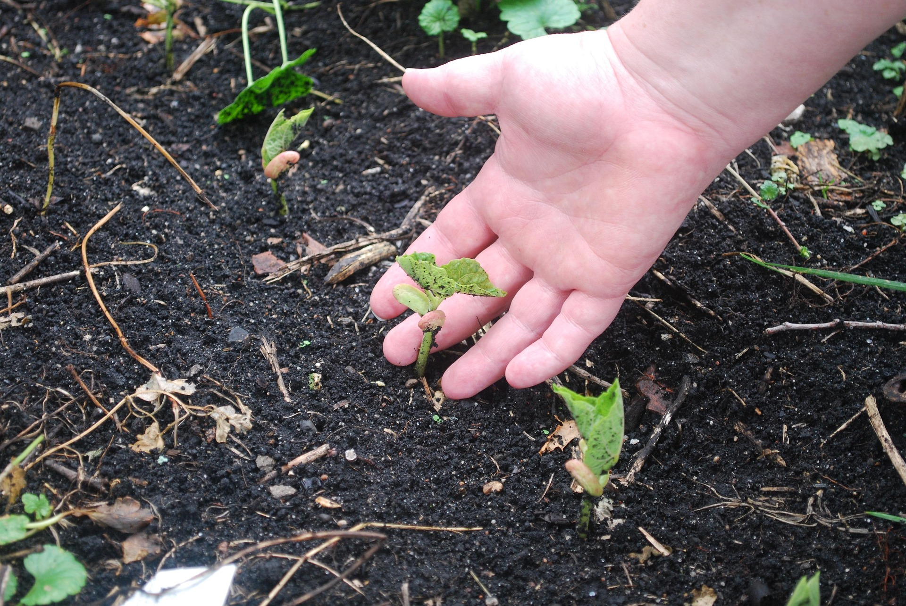
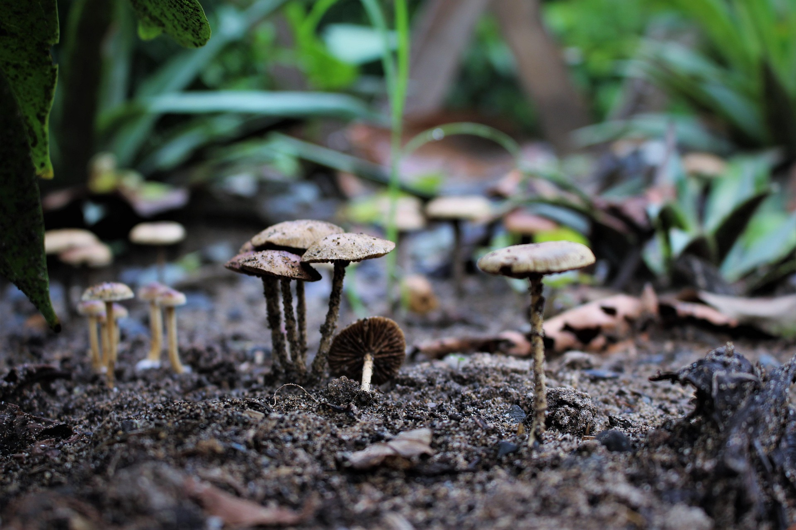

+++
title = "Kulturpflanzengemeinschaften Teil 1 - Bodenfruchtbarkeit"
description = "Dieser Blog behandelt das Thema Bodenfruchtbarkeit in Kulturpflanzengemeinschaften"
date = 2025-11-28

extra.thumbnail = "/img/soil-fertility.jpg"
+++

# Bodenfruchtbarkeit

Die Grundvoraussetzung für gesunde Pflanzen in der Landwirtschaft ist eine gute Bodenfruchtbarkeit. Die moderne Landwirtschaft bringt sehr hohe Erträge, führt aber leider oft dazu, dass die Bodenfruchtbarkeit abnimmt[^1]. 

Im Boden laufen verschiedene biologische, chemische und physikalische Prozesse ab, die beeinflussen, wie gut eine Pflanze, welche in diesem Boden wächst, mit Nährstoffen, Wasser und Luft versorgt werden kann. Wenn diese Versorgung gut funktioniert, spricht man von einem fruchtbaren Boden. Auf der anderen Seite beeinflussen die Pflanzen wiederum diese Prozesse, indem sie beispielsweise den Boden durchwurzeln, und so die Durchlüftung und Wasserdurchlässigkeit verbessern, oder organisches Material akkumulieren, was den Anteil an organischer Substanz im Boden erhöht. Verschiedene Kulturen haben unterschiedliche Einflüsse auf die Bodenbeschaffenheit und können – einzeln oder in Pflanzengemeinschaften - genutzt werden, um die Eigenschaften des Bodens aktiv zu ändern.  

Ein Boden setzt sich zusammen aus mineralischer Substanz, organischer Substanz, Wasser und Luft. Die Anteile liegen dabei etwa bei 5% organischer Substanz und 45% mineralischer Substanz. Die restlichen 50% sind Wasser oder Luft, je nach aktueller Feuchtigkeit des Bodens[^2].  

Es mag erstaunlich sein, dass der Anteil organischen Materials bei nur etwa fünf Prozent liegt, und oft sogar tiefer ist. Trotzdem ist dieser Anteil und dessen Zusammensetzung zentral für die Bodenfruchtbarkeit[^3].

In der Natur leben Pflanzen meistens in Gemeinschaften, welche sich in einem stabilen Ökosystem befinden. Ein Teil dieses Ökosystems sind auch die Bodenlebewesen. Die Zusammensetzung der Bodenlebewesen kann sich stark unterscheiden. So sind beispielsweise auf Wiesen mehr Bakterien als Pilze vorhanden, während in Wäldern die Pilze den Grossteil der Bodenlebewesen ausmachen. 

Als Kulturpflanzengemeinschaften werden Pflanzengemeinschaften bezeichnet, welche ausschliesslich oder hauptsächlich aus Kulturpflanzen bestehen. Eine Kulturpflanzengemeinschaft ist aus ökologischer Sicht oft an eine natürliche Pflanzengemeinschaft angelehnt und versucht so, die positiven Wechselwirkungen dieser nachzustellen.  

Es gibt verschiedene Mechanismen, welche die Bodenfruchtbarkeit in einer (Kultur)-Pflanzengemeinschaft positiv beeinflussen. Im Folgenden werden ein paar dieser Mechanismen vorgestellt. Die Mechanismen hängen häufig direkt mit den Eigenschaften der eingesetzten Kulturen zusammen.  

# Mechanismen 

## Erhöhung der Bodenaktivität 

Eine höhere Pflanzendiversität führt zu einer höheren Aktivität und Diversität der Bodenlebewesen, wie Bakterien und Pilzen, aber auch Kleintieren wie Arthropoden und Regenwürmern. Bodenarthropoden sind ein guter Indikator für die Bodengesundheit, da sie für viele essenzielle Abläufe im Boden, wie den Humusaufbau oder die Belüftung eine wichtige Rolle spielen.  

In einem Experiment in Deutschland wurden im Jahr 2002 Wiesen mit unterschiedlicher Anzahl Arten und funktionalen Gruppen gepflanzt[^4]. Ziel des Experiments ist es, die Effekte der Biodiversität über einen langen Zeitraum zu analysieren. In einer Auswertung von 2015[^5] wurde nachgewiesen, dass die Bodenaktivität in Flächen mit grösserer Pflanzenvielfalt höher ist als auf Flächen mit niedrigerer Pflanzenvielfalt. Eine weitere Auswertung von 2017 zeigt, dass auch die Vielfalt der Bodenarthropoden mit steigender Pflanzenvielfalt zunimmt[^6]. Zusätzlich wurde die Zusammenstellung komplexer, und die Anzahl an seltenen Spezies nahm zu.   

Ein gesundes Bodenleben führt dazu, dass den Pflanzen Nährstoffe in einer geeigneten Form zur Verfügung stehen. Gleichzeitig wird der Krankheitsdruck verringert, da die Konkurrenz für pathogene Bodenorganismen gestärkt wird. Im Gegensatz zu jährlichen Kulturen können sich die Prozesse der Bodenaktivität in Pflanzengemeinschaften mit mehrjährigen Kulturen, wie dem Agroforst, ungestört entfalten.  

## Bildung von Bodenkrümeln 

Bodenkrümel sind Zusammensetzungen aus mineralischen und organischen Bestandteilen und Huminstoffen, welche durch die Ausscheidungen von Bodenlebewesen, sowie Pilzen und Bakterien zu porösen Strukturen verklebt sind. Eine gute Krümelstruktur erhöht die Wasserspeicherung sowie die Sauerstoffverfügbarkeit. Zusätzlich wird das Erosionsrisiko verringert, da die Krümel eine gewisse Stabilität aufweisen und das Wasser im Boden besser versickert. Bodenkrümel schaffen wiederum Lebensraum für Bodenorganismen, da hier geeignete Lebensbedingungen herrschen. Die gute und dauerhafte Bodenbedeckung im Agroforst und die Ausnutzung der verschiedenen Ebenen hilft die Bodenkrümel von oben nach unten dauerhaft zu verbessern.   

## Förderung von Mykorrhiza-Pilzen 

Mykorrhiza bezeichnet eine Symbiose zwischen Pflanzen und bestimmten Pilzarten. Die Hyphen (Pilzfäden) sind in Kontakt mit den Pflanzenwurzeln, wo eine Art Austausch stattfindet. Der Pilz versorgt die Pflanze mit Wasser und gelösten Nährstoffen, insbesondere Phosphor, während die Pflanzen den Pilzen dafür Zucker geben[^7]. Mykorrhiza-Pilze bilden unterirdische Netzwerke, welche den Nährstoffaustausch über grosse Distanzen ermöglichen. Aus Sicht der Pflanze wird so ihr Wurzelbereich um ein Vielfaches erhöht und die Pflanze wird stresstoleranter und widerstandsfähiger gegenüber Pathogenen[^14]. Ungestörte und leicht basische Böden eines Food Forests können gute und nachhaltige Habitate für Mykorrhiza-Pilze sein.

Es gibt zwei grosse Gruppen von Mykorrhiza-Pilzen: 

1. Ektomykorrhiza sind Pilze, deren Hyphen in die Wurzel der Pflanzen eindringen, nicht jedoch in die Wurzelzellen, sondern in den Zwischenräumen ein Netzwerk bilden. Ektomykorrhiza gehen oft in Symbiose mit Bäumen, und sind so beispielsweise in den mitteleuropäischen Wäldern sehr verbreitet. Einige Ektomykkorhizae bilden auch Fruchtkörper aus, wie z.B. die Trüffel (Tuber). 

2. Endomykorrhiza dringen mit ihren Hyphen in der Wurzelzellen der Pflanze ein, wo der Austausch von Nährstoffen und Zuckern stattfindet. Innerhalb der Endomykorrhiza ist für die Landwirtschaft insbesondere die Klasse der arbuskulären Mykorrhizapilze relevant. Diese gehen eine Symbiose mit einer grossen Zahl and Landpflanzen ein, z.B. Getreide oder Gemüse. Sie bilden ausserdem Glomalin, ein Protein, welches die Bildung von Bodenkrümeln fördert. Arbuskuläre Mykorrhiza-Pilze bilden nie oberirdische Fruchtkörper aus. 

## Stickstofffixierung 

Bestimmte Kulturpflanzen gehen eine Symbiose mit stickstofffixierenden Bakterien ein. Die Bakterien leben dabei in Knöllchen, die direkt mit den Wurzeln der Pflanze verbunden sind. Die Bakterien sind in der Lage, in einem sehr energieintensiven Prozess atmosphärischen Stickstoff in eine wasserlösliche Form umzuwandeln. Die Bakterien beliefern die Pflanzen mit Stickstoff und erhalten im Gegenzug Zuckermoleküle[^8]. Mit dem durch den Prozess zusätzlich in das System eingetragenen Stickstoff verringert sich der Bedarf an externem Stickstoffdünger. 

Die landwirtschaftlich bedeutendste Pflanzenfamilie, welche eine Symbiose mit stickstofffixierenden Bakterien eingeht, sind die Leguminosen, welche Pflanzen wie Soja, Kichererbsen und Bohnen enthält. Die Bakterien, welche die Symbiose mit Leguminosen eingehen, heissen Rhizobien oder Knöllchenbakterien. Die unteren Ebenen eines Food Forests, wie Büsche oder dauerhafte Bodenbedeckung, bieten sich für stickstofffixierende Pflanzen an und können regelmässig Stickstoff in den Boden abgeben.  

## Grössere Wasser- und Nährstoffverfügbarkeit durch unterschiedliche Durchwurzelung 

Die Integration von Kulturpflanzen mit unterschiedlicher Durchwurzelung des Bodens kann zu einem verbesserten Wasser- und Nährstoffhaushalt im Boden führen. In einem typischen Agroforst, in welchem Bäume mit einer einjährigen Kultur kombiniert werden, wird der Baum durch Konkurrenz und Wurzelschnitt (oberflächliche Wurzeln werden bewusst wiederholt verletzt) dazu gezwungen, tiefer zu Wurzeln. Als Resultat bildet der Baum mit seinem Wurzelwerk eine Art Auffangnetz für Ressourcen[^9]. Ähnlich können auch bewusst tiefwurzelnde Pflanzen in eine Kulturpflanzengemeinschaft integriert werden, welche dann Wasser und Nährstoffe in das System eintragen, die ansonsten unerreicht bleiben oder ausgewaschen werden. 

Zusätzlich gibt es einen Effekt, der als “Hydraulic Lift” bezeichnet wird[^10]. Tagsüber wird Wasser aus allen Bodentiefen aufgenommen und fliesst in den Transpirationsstrom. In der Nacht, wenn die Transpiration unterbrochen ist, erfolgt die Wasserbewegung passiv über einen Wasserpotenzialsgradienten entlang der Pflanzenwurzeln von den tieferen, feuchteren Zonen zu den flacheren, trockeneren Zonen.  

# Experimente mit Kulturpflanzengemeinschaften 

Im Folgenden werden beispielhaft Experimente mit Kulturpflanzengemeinschaften beschrieben, bei welchen eine Verbesserung der Bodenfruchtbarkeit festgestellt werden konnte. Meistens sind dabei mehrere Mechanismen aus dem vorherigen Abschnitt von Bedeutung. 

## Intercropping mit Leguminosen 

Beim Intercropping werden mehrere Kulturpflanzen mit zeitlicher Überschneidung auf demselben Feld gepflanzt. Beliebt sind zum Beispiel Mischungen von Getreide/Mais mit Leguminosen. 

Eine Meta-Analyse von 2025 untersuchte, wie sich Leguminosen-Intercroppings auf die Bodengesundheit auswirken[^11]. Es konnte nachgewiesen werden, dass das Intercropping die Vielfalt der Mikroorganismen im Boden, insbesondere Bakterien und Pilzen, erhöht. Der Effekt ist allerdings stark von den Bedingungen und dem Bodenmikrobiom des spezifischen Standortes abhängig. Im selben Experiment wurde auch eine signifikante Verbesserung der Bodenstruktur gegenüber einer Monokultur nachgewiesen. Tiefwurzelnde Pflanzen wie z.B die Erdnüsse lockern verdichtete Bodenhorizonte und fördern die Bildung von Bodenkrümeln. Zudem konnte eine Steigerung des im Boden gespeicherten Kohlenstoffs und Stickstoff und eine erhöhe Aufnahmefähigkeit von Phosphor durch die Pflanzengemeinschaft festgestellt werden. 

Eine andere Studie bestätigt, dass bei Intercroppings mit Leguminosen der externe Stickstoffeintrag reduziert werden kann, bei gleichbleibendem oder höherem Gesamtertrag[^12]. 

## Silvoarabler Agroforst 

In silvoarablen Agroforstsystemen werden Bäume und Sträucher mit einjährigen Ackerkulturen kombiniert. Die Bäume werden dabei in Reihen angeordnet und zwischen den Baumreihen befindet sich die Ackerfläche. Der Baumreihenabstand ist dabei so gewählt, dass eine effiziente Bearbeitung und Ernte der Ackerfläche möglich ist (z.B. ein Vielfaches der Maschinenbreite). 

Eine Studie aus England untersucht die Auswirkung der Baumreihen auf die Bodenstruktur in einem etablierten Agroforst durch einen Vergleich mit einem Kontrollfeld[^13]. Dabei konnte festgestellt werden, dass es im Agroforst zu weniger Bodenverdichtung kommt, insbesondere in den tieferliegenden Bodenschichten. Der Effekt war nicht nur in den Baumreihen festzustellen, sondern auch in den ackerbaulichen Streifen. Zusätzlich konnte eine höhere Verfügbarkeit von Nährstoffen, insbesondere Phosphor, festgestellt werden. Gleichzeitig konnte aber auch nachgewiesen werden, dass sich die Ackerkulturen und Bäume im Übergangsbereich in Konkurrenz um Nährstoffe befinden. 

---
---
---

 
 
 

# Quellen
[^1]: Kopittke, P. M., Menzies, N. W., Wang, P., McKenna, B. A., & Lombi, E. (2019). Soil and the intensification of agriculture for global food security. Environment International, 132, 105078. https://doi.org/10.1016/j.envint.2019.105078
[^2]: Soil. (2024). In Wikipedia. https://en.wikipedia.org/wiki/Soil 
[^3]: UC Davis. (n.d.). Low Organic Matter. Soil Health. https://soilhealth.ucdavis.edu/soil-challenges/low-organic-matter 
[^4]: Roscher, C., Schumacher, J., Baade, J., Wilcke, W., Gleixner, G., Weisser, W. W., Schmid, B., & Schulze, E.-D. (2004). The role of biodiversity for element cycling and trophic interactions: An experimental approach in a grassland community. Basic and Applied Ecology, 5(2), 107–121. https://doi.org/10.1078/1439-1791-00216 
[^5]: Lange, M., Eisenhauer, N., Sierra, C. A., Bessler, H., Engels, C., Griffiths, R. I., Mellado-Vázquez, P. G., Malik, A. A., Roy, J., Scheu, S., Steinbeiss, S., Thomson, B. C., Trumbore, S. E., & Gleixner, G. (2015). Plant diversity increases soil microbial activity and soil carbon storage. Nature Communications, 6, 6707. https://doi.org/10.1038/ncomms7707 
[^6]: Ebeling, A., Hines, J., Hertzog, L. R., Lange, M., Meyer, S. T., Simons, N. K., & Weisser, W. W. (2018). Plant diversity effects on arthropods and arthropod-dependent ecosystem functions in a biodiversity experiment. Basic and Applied Ecology, 26, 50-63. https://doi.org/10.1016/j.baae.2017.09.014
[^7]: Smith, S. E., & Read, D. J. (2008). Mycorrhizal Symbiosis (3rd ed.). Academic Press. 
[^8]: Wagner, S. C. (2011). Biological nitrogen fixation. Nature Education Knowledge, 3(10), 15. https://www.nature.com/scitable/knowledge/library/biological-nitrogen-fixation-23570419/ 
[^9]: Hugenschmidt, J., & Kay, S. (2023). Unmasking adaption of tree root structure in agroforestry systems in Switzerland using GPR. Geoderma Regional, 34, e00659. https://doi.org/10.1016/j.geodrs.2023.e00659 
[^10]: Horton, J. L., & Hart, S. C. (1998). Hydraulic lift: A potentially important ecosystem process. Trends in Ecology & Evolution, 13(6), 232-235. https://doi.org/10.1016/S0169-5347(98)01328-7 
[^11]: Ananthi, K., Parasuraman, P., Prabhu, K., Vijayakumar, S., Thangadurai, K., Mahendran, M., Rajaprakasam, S., & Channaveeraswami, A. (2025). Boosting resource use efficiency, soil fertility, food security, ecosystem services, and climate resilience with legume intercropping: A review. Frontiers in Sustainable Food Systems, 9, 1527256. https://doi.org/10.3389/fsufs.2025.1527256
[^12]: Li, C., Stomph, T. J., Makowski, D., Li, H., Zhang, C., Zhang, F., & van der Werf, W. (2023). The productive performance of intercropping. Proceedings of the National Academy of Sciences, 120(2), e2201886120. https://doi.org/10.1073/pnas.2201886120 
[^13]: Judson, J. B., Chapman, P. J., Holden, J., & Galdos, M. V. (2025). Alley width and slope position influence soil carbon storage, nutrient dynamics and hydrology at a mature silvoarable site, SW England. Catena, 260, 109439. https://doi.org/10.1016/j.catena.2025.109439 
[^14]: Jacke, D. H., & Toensmeier, E. (2005). Edible forest gardens: Vol. 1. Ecological vision and theory for temperate climate permaculture. Chelsea Green Publishing. 