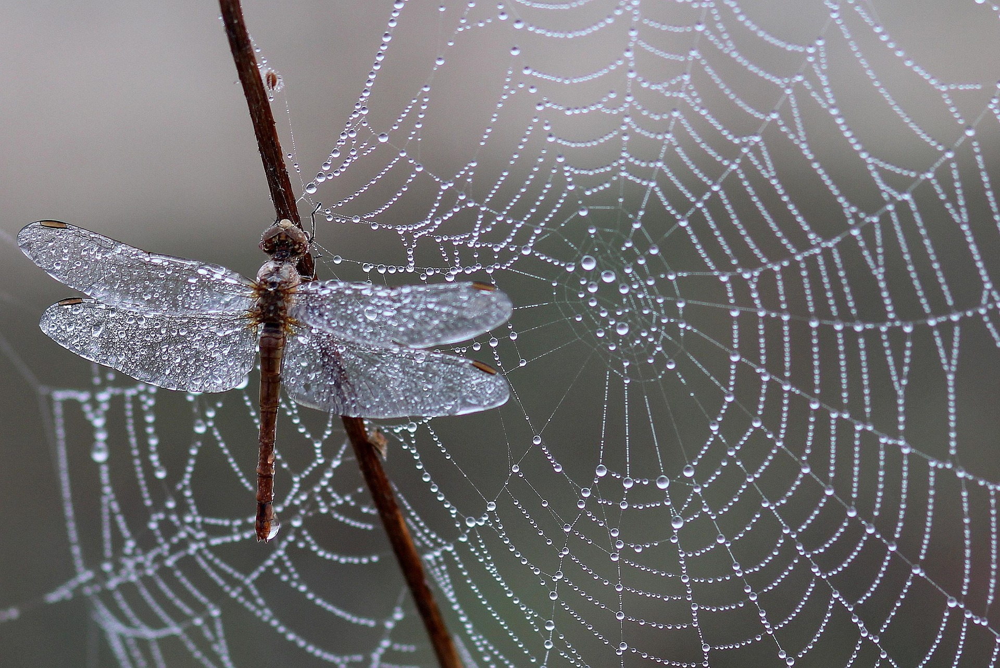

+++
title = "Kulturpflanzengemeinschaften Teil 2 - Mikroklima"
description = "Dieser Blog behandelt das Thema Mikroklima in Kulturpflanzengemeinschaften"
date = 2025-11-29

extra.thumbnail = "/img/microclimate.jpg"
+++

# Mikroklima
Das Mikroklima bezeichnet die lokalen bodennahen klimatischen Verhältnisse an einem Standort. Diese werden sowohl von der Bepflanzung wie auch von der lokalen Topografie beeinflusst. In einer Kulturpflanzengemeinschaft haben insbesondere Bäume erhebliche mikroklimatische Effekte. Im Folgenden werden ein paar Mechanismen vorgestellt, welche das Mikroklima beeinflussen. 

## Schatten 

Bäume werfen Schatten auf tieferliegende Pflanzen. Dieser Effekt kann sowohl einen positiven wie auch negativen Einfluss auf das Pflanzenwachstum der beschatteten Pflanzen haben. Bei der Planung einer Kulturpflanzengemeinschaft muss der Schattenwurf von Bäumen mitberücksichtigt werden, um die positiven Wechselwirkungen zu maximieren und die negativen Wechselwirkungen möglichst minimal zu halten. Werden beispielsweise in einem Agroforst die Baumreihen in Nord-Süd-Richtung gepflanzt, ist der Schattenwurf auf die Ackerflächen gleichmässiger verteilt als bei einer Orientierung in West-Ost-Richtung, da im letzteren Fall die Beschattung auf der Nordseite der Baumreihe sehr stark ist. 

Abbildung 1: Schattenwurf der Baumkronen (Quelle: Pixabay.com)

 

Eine Studie von 2016 aus Deutschland fand, dass Ackerkulturen sehr unterschiedlich auf Beschattung reagieren[^1]. Es wurden unter anderem Winterweizen, Silomais sowie Kartoffeln über zwei Jahre (2015 und 2016) mit jeweils vier unterschiedlichen Beschattungsstufen angepflanzt. Der Silomais reagierte am stärksten auf Beschattung, und schon bei der geringsten Beschattungsstufe kam es zu signifikanten Ertragseinbussen. Der Winterweizen litt weniger unter der Beschattung. Hier war ein Unterschied zwischen dem heissen und trockenen Jahr 2015, und dem eher regnerischen Jahr 2016, festzustellen. 2015 nahm der Ertrag des Winterweizens erst ab der grössten Beschattungsstufe signifikant ab, während im Jahr 2016 der Ertrag mit der zunehmenden Beschattung stufenweise abnahm. Bei der Kartoffel gab es einen ähnlichen Effekt. Im Jahr 2015 unterschieden sich die Erträge unter den Beschattungsstufen kaum, 2016 war der Ertrag bei mittlerer und hoher Beschattung allerdings signifikant reduziert.  

Der Effekt der Beschattung wirkt sich also unterschiedlich aus, je nach den gegebenen Wetterverhältnissen. Mit dem Klimawandel sind in Europa heissere und trockenere Sommer zu erwarten[^3], welche die positiven Effekte der Beschattung verstärken könnten. Zusätzlich ist zu beachten, dass aktuelle Sorten daraufhin gezüchtet wurden, unter voller Sonne zu wachsen. 

Eine andere Studie untersuchte Agroforstsysteme in der Schweiz, bei denen als Ackerkultur Gerste angepflanzt wurde[^2]. Dort wurde festgestellt, dass es bei moderater Beschattung zu einer kleinen Ertragseinbusse kommt, diese bei starker Beschattung allerdings deutlich höher ist.  

## Wind 

Baumreihen und Hecken habe einen erheblichen Einfluss auf den Wind und können die Windstärke reduzieren, Windrichtungen ändern und Turbulenzen erzeugen. Wie genau der Wind verändert wird hängt unter anderem von der Höhe, Ausrichtung und Permeabilität des Windschutzes ab. 

Ist eine Windschutzhecke senkrecht zur Windrichtung platziert, entsteht auf der windabgewandten Seite der Hecke eine sogenannte quiet Zone, in welcher die Windgeschwindigkeit um etwa 50% reduziert ist. Diese Zone ist etwa siebenmal so lang wie die Höhe der Hecke. Dahinter befindet sich die wake Zone, mit einer Länge bis zu 20-mal die Höhe der Hecke, in welcher der Wind immer noch vom Windschutz beeinflusst wird, allerdings gibt es hier mehr Turbulenzen[^6].  

Ein effektiver Windschutz erhöht Erntemengen von vielen Ackerkulturen signifikant[^5].

## Temperatur 

Die Temperatur in einer Kulturpflanzengemeinschaft wird von den Bäumen auf verschiedene Weise beeinflusst. Schauen wir uns das beispielhaft für Baumreihen an, die entweder Teil von einer Hecke oder von einem Agroforstsystem sein können. 

Einerseits bleibt durch die Beschattung die Luft direkt unter den Baumreihen tagsüber kühler. Ausserdem verdunsten die Bäume über die Blattmasse eine grosse Menge Wasser, was zu einer weiteren Abkühlung führt. Da die Bäume gleichzeitig den Wind reduzieren und Verwirbelungen produzieren, wird die feuchte, kühle Luft nicht direkt abgetragen, sondern bleibt im System. Dies ist insbesondere in Systemen mit Bäumen von unterschiedlichen Höhen der Fall.

Abbildung 2: Mikroklima im Agroforst (Quelle: Pixabay.com)

 

Auf der anderen Seite reduzieren die Bäume die Windgeschwindigkeit erheblich. Das kann wiederum dazu führen, dass sich die heisse Luft im inneren des Systems anstaut, und es dort tagsüber zu einer Erhöhung der Temperatur kommt, welche durch die gespeicherte Wärme im Boden auch während der Nacht anhält.

Eine Studie von 2018 untersucht die mikroklimatischen Effekte von Pappelhecken in Brandenburg[^4]. Sie fand, dass die Lufttemperatur innerhalb der Baumreihe tagsüber tendenziell kühler und während der Nacht wärmer ist als auf dem offenen Vergleichsfeld. Dieser Effekt war bei höherer Temperatur ausgeprägter. In einem gewissen Abstand von den Baumreihen konnte eine Erhöhung der mittleren Tagestemperatur festgestellt werden. Dieser Effekt war allerdings nur bis zu einem Abstand von 9 Metern zu den Baumreihen präsent und verschwand gegen die Mitte des Feldes. Das deckt sich mit der Tatsache, dass die windstillenden Effekte nur bis zu einem gewissen Abstand zur Hecke anhalten. In der Nacht konnte wider Erwarten auf der Ackerfläche zwischen den Baumreihen teilweise eine minime Reduktion der Temperatur gemessen werden. 

---
---
---

 
 
 

# Quellen
[^1]: Schulz, V. S., Munz, S., Stolzenburg, K., & Hartung, J. (2016). Auswirkungen von Beschattung durch Agrofrost auf landwirtschaftliche Kulturen [Effects of shading by agroforestry on agricultural crops]. In Mitteilungen der Gesellschaft für Pflanzenbauwissenschaften (Vol. 28, pp. 90–91). Landwirtschaftliches Technologiezentrum Augustenberg. 
[^2]: Vaccaro, C., Six, J., & Schöb, C. (2022). Moderate shading did not affect barley yield in temperate silvoarable agroforestry systems. Agroforestry Systems, 96(4), 799–810. https://doi.org/10.1007/s10457-022-00740-z 
[^3]: Felsche, E., Böhnisch, A., Poschlod, B., & Ludwig, R. (2024). European hot and dry summers are projected to become more frequent and expand northwards. Communications Earth & Environment, 5, Article 410. https://doi.org/10.1038/s43247-024-01575-5 
[^4]: Kanzler, M., Böhm, C., Mirck, J., Schmitt, D., & Veste, M. (2019). Microclimate effects on evaporation and winter wheat (Triticum aestivum L.) yield within a temperate agroforestry system. Agroforestry Systems, 93(5), 1821–1841. https://doi.org/10.1007/s10457-018-0289-4 
[^5]: Kort, J. (1988). Benefits of windbreaks to field and forage crops. Agriculture, Ecosystems & Environment, 22/23, 165–190. https://doi.org/10.1016/0167-8809(88)90017-5 
[^6]: Crawford, M. (2010). Creating a forest garden: Working with nature to grow edible crops. Green Books. 