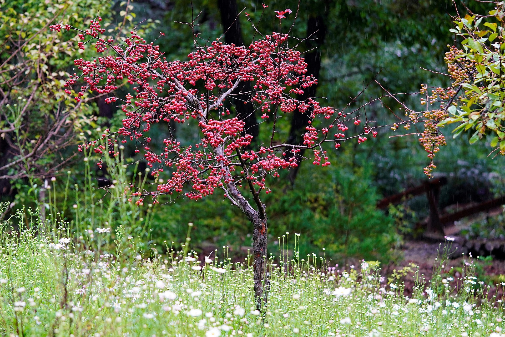

+++
title = "Kulturpflanzengemeinschaften Teil 3 - Pflanzenschutz"
description = "Dieser Blog behandelt das Thema Pflanzenschutz in Kulturpflanzengemeinschaften"
date = 2025-11-28

extra.thumbnail = "/img/pest-management.jpg"
+++

# Nützlingsförderung 

Einige Studien, deuten darauf hin, dass Obst-Plantagen mit üppigem Blütenunterwuchs ein deutlich geringeres Auftreten von Insektenschädlingen aufweisen als kultivierte Obstgärten. Der Effekt basierte hauptsächlich auf einer erhöhten Häufigkeit und Effizienz von Prädatoren und Parasitoiden und anderen Effekten im Zusammenhang mit Habitatveränderungen[^1]. Typhlodromus pyri ist eine wichtige Raubmilbenart im Schweizer Obstbau, die als natürlicher Fressfeind von Spinnmilben zur Regulierung eingesetzt werden kann. Da sie sich neben Spinnmilben, Blattgallmilben und Kräuselmilben auch von Pollen ernährt, kann ihre Förderung durch eine reduzierte Mahd beziehungsweise das Angebot diverser Blüten in Pflanzengemeinschaften oder Blütenunterwuchs in Obstgärten, unterstützt werden[^2].

Abbildung 1: Saumstreifen aus Wildblumen (Quelle: Pixabay.com)

 

Mischkulturen konnten in einem Versuch im Vergleich zu den Monokulturen die Häufigkeit nützlicher Arthropoden um 36 %, deren Dichte um 94 % und deren Artenreichtum um 27 % signifikant erhöhen. Gleichzeitig verringerten Mischkulturen die Häufigkeit von Arthropodenschädlingen um 38 % und deren Dichte um 41 %, während deren Artenreichtum unbeeinflusst blieb. Mischkulturen wirkten sich also durchweg positiv auf den Artenreichtum von Bestäubern, Parasitoiden und Prädatoren aus[^3]. Das führt zu einer effektiveren Nützlingsförderung und Schädlingsbekämpfung durch Pflanzgemeinschaften.

Zusätzlich zeigt sich, dass Mosaik-Strukturen, die durch Pflanzengemeinschaften gebildet werden können, in vielen Fällen, unter den artenreichsten natürlichen Strukturen sind. Es zeigt sich, dass durch Ekotone, wo zwei oder mehrere Lebensraumgrenzen aufeinandertreffen, ein „Edge Effect“ entsteht und besonders grosse Biodiversität aufweisen. Das ist speziell der Fall für eine hohe Diversität von Nützlingen. So kann die durch Pflanzengemeinschaften entstandene Sturkurveränderungen dazu beitragen, dass Nützlinge gefördert und Schädlinge verdrängt werden. Untersuchungen von Agrarlandschaften in Europa und Nordamerika kamen zu dem Ergebnis, dass kleinere Felder, vielfältigere Kulturen und strukturreiche Landschaften mit höherer Biodiversität verbunden und oft sogar diverser sind als die Schaffung naturnaher Flächen. Die ETH Zürich findet, dass die Mischung von Wiesen, Wäldern, Siedlungen und Gewässern die Funktion und Stabilität einer Landschaft verbessern, sogar unabhängig von Pflanzenvielfalt, Region und Klima[^4]. Dasselbe Muster zeigt sich bei Graslandschaften, wenn verschiedene Nutzungsformen wie Wiesen, Weiden und ungedüngte Biodiversitätsförderflächen mosaikartig zusammen bestanden[^5]. Auch in der Schweizer Agrarpolitik zur Biodiversitätsförderung der Landwirtschaft wird betont, dass vielfältige Strukturen mit Hecken, Baumgruppen, Säume und andere kleinräumige Strukturen für Bestäuber und Nützlinge besonders wichtig sind[^6]. Beim Agroforst gilt es allerdings zu beachten, dass durch zu viel Schatten die Biodiversität lichtliebender Arten abnehmen kann und so für Schädlinge anfällig wird.

Abbildung 2: Obstbau mit Unterwuchs (Quelle: Pixabay.com) 

 

# Schädlingsbekämpfung: Guard-, Trap-, Repellant- & Push-Pull- Cropping[^7]

Die integrierte Schädlingsbekämpfung fokussiert sich auf ein ganzheitliches, langfristiges und möglichst umweltschonendes Management von Schädlingen. Die Nutzung von Pflanzengemeinschaften ist dabei ein zentraler Bestandteil und funktioniert via Barrieren, Anlockung, Abschreckung oder einer Kombination. Bekannte Konzepte in Europa sind hierfür Intercropping Methoden wie das „Guard Cropping“, „Trap Cropping“, „Repellant Cropping“, sowie das kombinierte „Push-Pull Cropping“.  

Beim „Guard Cropping“ setzt man besonders robuste oder dornige Pflanzen am Rande der Kultur oder als Zwischenreihe ein. Sie dienen so als natürliche, mechanische Barriere vor invasiven Schädlingen und vermindern die Verbreitung von Krankheiten in der Hauptkultur. Bevorzugte Arten sind in Mitteleuropa zum Beispiel Getreidearten wie Hirse, Roggen aber auch Distelarten wie die Öldistel. In einer Studie, in der unter anderen Anbausystemen auch Streifenanbau und Patch-Anbau getestet wurden, zeigte sich, dass im Vergleich zum klassischen Ackerbau, die natürliche Schädlingsregulierung in solchen Cropping Systemen gefördert wurden und so eine Alternative zu chemischen Pflanzenschutzmitteln bieten konnten[^8].

Durch das „Trap Cropping“ werden Schädlinge auf weniger wertvollen Kulturen umgeleitet, um die Hauptkultur so vor den Schädlingen zu schützen. Beliebte Fang-Kulturen sind beispielsweise Senf, Kürbisarten (Blue Hubbard), Kirschtomaten und nicht-konsumierbare Kulturen wie Ringelblume oder Tagetes. Fangpflanzen locken nicht nur Insekten zur Nahrungsaufnahme und Eiablage an, sondern dienen als Sammelbecken für Krankheitserreger[^9]. Allerdings bürgt das Trap Cropping die Gefahr, dass durch die dauerhaft hohe Konzentration von Schädlingen an einigen wenigen Stellen, dass sich Resistenzen gegenüber Pflanzenschutzmitteln schneller entwickeln. Die Fangkultur sollte daher bei Bedarf biologisch oder mechanisch behandelt werden, damit diese keine Schädlinge und Resistenzen züchten. Zusätzlich besteht die Gefahr der Fang-Kulturen nicht nur Schädlinge aus der Hauptkultur anlocken, sondern auch von ausserhalb und so die Gesamtheit an Schädlingen in der Proximität erhöhen. Fangpflanzen sind also insbesondere eine interessante Option, wenn sie Schädlinge von der Hauptkultur innerhalb des Feldes anlocken („lokale Anlockung“), nicht aber, wenn sie Schädlinge aus Gebieten außerhalb des Feldes anlocken („regionale Anlockung“)[^1].

Beim „Repellant Intercropping“ werden Pflanzen, die gewisse Schädlinge von der Fläche der Kultur vertreiben, zwischen für Schädlinge anfällige Kulturen gepflanzt. Ein Beispiel hierfür sind Lauchgewächse wie Lauch oder Knoblauch. Diese können in einem Agroforst am Rande angebracht werden, sodass sie ausreichend Licht bekommen und gleichzeitig gewisse Schädlinge schon vor dem Eindringen in das Guild hindern beziehungsweise sie wieder herauslocken. Studien zeigten, dass Lauch (Allium porrum) als „companion plant“ zum Beispiel das Frassverhalten von Blattläusen stören konnte, es aber auch komplexe, teils gegensätzliche Wirkungen gab[^10].

Letztlich, kombiniert das „Push-Pull Cropping“ fangende und abstossende Pflanzen zusammen mit einer Hauptfrucht. Die abstossende Pflanzen, ähnlich zum Repellant Intercropping, vertreiben Schädlinge von der Hauptkultur und die anziehenden Pflanzen fangen die Schädlinge, ähnlich wie beim Trap Cropping. Zu den wichtigsten Vorteilen dieser Strategien zählen die geringere Abhängigkeit von Pestiziden, die gezielte Schädlingsbekämpfung, die Förderung der Biodiversität und die Bereitstellung zusätzlicher Ökosystemleistungen[^11]. So zeigt sich zum Beispiel bei einem Einsatz von Elefantengrass um das gesamte Feld und Desmodium als Reihenmischfrucht einen positiven Effekt gegen Schädlinge wie dem Maisstängelborer und dem Herbstheerwurm in Mais als Hauptfrucht. Während Elefantengrass Weibchen anlockt („pull“) vertreibt Desmodium Maisstängelbohrer oder lockt parasitäre Schlupfwespen an („push“). Weitere Studien zeigen auch, dass der Einsatz von Desmodium zusammen mit der Anlage von Blühstreifen zur Förderung natürlicher Feinde in Europa und den USA ein positiver Effekt haben kann – ebenfalls via Push-Pull Effekt[^11].

Pflanzengemeinschaften können auch weiter eingesetzt werden, um Unkräuter zu unterdrücken und die Beschattung durch Bäume Unkräuter und Schädlinge reduzieren. Wissenschaftler fanden, dass Begleitpflanzen keinen signifikanten Einfluss auf den Ertrag der Hauptfrucht hatten, allerdings die Unkrautbiomasse verringerten, und zwar um 56 % im Vergleich zu einer nicht gejäteten Kontrollbehandlung und um 42 % im Vergleich zu einer gejäteten Behandlung[^12]. Batish et al. (2008) finden, dass die Beschattung durch Bäume die Schädlingsdichte in Unterwuchs-Kulturen deutlich verringern[^1]. Generell kann das Intercropping sowie die Nutzung von Wildblumen mit einer Hauptfrucht, die Schädlinge bekämpfen kann. In einem Feldversuch in Deutschland wurde die Kombination von Mischkulturen (Ackerbohne-Weizen, gefolgt von Mohn-Gerste) mit mehrjährigen Wildblumenstreifen getestet. Es ergab sich, dass die biologische Regulierung von Blattläusen und Unkräutern stärkt und die Produktivität des Anbausystems steigert. Die Studie belegt die Vorteile von Wildblumenstreifen zur Stärkung der biologischen Schädlingsbekämpfung und Steigerung der Produktivität des Anbausystems[^13].

---
---
---

 
 
 

# Quellen
[^1]: Batish, D. R., Kohli, R. K., Jose, S., & Singh, H. P. (2008). Ecological basis of agroforestry. CRC Press.  
[^2]: Puchalska, E. K., & Kozak, M. (2015). Typhlodromus pyri and Euseius finlandicus (Acari: Phytoseiidae) as potential biocontrol agents against spider mites (Acari: Tetranychidae) inhabiting willows: Laboratory studies on predator development and reproduction on four diets. Experimental & Applied Acarology, 66(1), 57–75. https://doi.org/10.1007/s10493-015-9906-3 
[^3]: Rakotomalala, A. A. N. A., Ficiciyan, A. M., & Tscharntke, T. (2023). Intercropping enhances beneficial arthropods and controls pests: A systematic review and meta‑analysis. Agriculture, Ecosystems & Environment, 356, 108617. https://doi.org/10.1016/j.agee.2023.108617 
[^4]: Oehri, J., Schmid, B., Schaepman‑Strub, G., & Niklaus, P. A. (2020). Terrestrial land-cover type richness is positively linked to landscape‑level functioning. Nature Communications, 11, 1‑10. https://doi.org/10.1038/s41467-019-14002-7 
[^5]: Richter, F. J., Suter, M., Lüscher, A., Buchmann, N., El‑Benni, N., Feola‑Conz, R., Hartmann, M., Jan, P., & Klaus, V. H. (2024). Effects of management practices on the ecosystem-service multifunctionality of temperate grasslands. Nature Communications. https://doi.org/10.1038/s41467-024-48049-y 
[^6]: Bundesamt für Landwirtschaft (BLW). (2021). Agrarbericht 2021: Biodiversitätsfördernde Strukturen. https://2021.agrarbericht.ch/de/umwelt/biodiversitaet/biodiversitaetsfoerdernde-strukturen 
[^7]: Fischer, E. (2025). Pflanzenschutz in alternativen Anbausystemen [PowerPoint slides]. Agroecology and Food Systems, Zürcher Hochschule für Angewandte Wissenschaften. 
[^8]: Thompson, J. B., Döring, T. F., Bellingrath‑Kimura, S. D., Grahmann, K., Glemnitz, M. & Reckling, M. (2024). Spatial arrangement of intercropping impacts natural enemy abundance and aphid predation in an intensive farming system. Agriculture, Ecosystems & Environment, 378, 109324. https://doi.org/10.1016/j.agee.2024.109324 
[^9]: Sarkar, S. C., Endong, W., Wu, S., & Lei, Z. (2018). Application of trap cropping as companion plants for the management of agricultural pests: A review. Insects, 9(4), 128. https://doi.org/10.3390/insects9040128  
[^10]: Baudry, X., Doury, G., Couty, A., Fourdrain, Y., van Havermaet, R., Lateur, M., & Ameline, A. (2021). Antagonist effects of the leek Allium porrum as a companion plant on aphid host plant colonization. Scientific Reports, 11, 4032. https://doi.org/10.1038/s41598-021-83580-8 
[^11]: Yadav, S. K., Narwade, D. K., Panigrahi, C. K., Kumar, G., Rout, S., Shanker, P., Chaturvedi, K., Tiwari, A. K., & Pandey, S. K. (2025). Push-Pull Strategies and Habitat Manipulation for Sustainable Insect Pest Management in Crops. Uttar Pradesh Journal of Zoology, 46(3), 1–16. https://doi.org/10.56557/upjoz/2025/v46i34778 
[^12]:Verret, V., Gardarin, A., Pelzer, E., Médiène, S., Makowski, D., & Valantin-Morison, M. (2017). Can legume companion plants control weeds without decreasing crop yield? A meta-analysis. Field Crops Research, 204, 158–168. https://doi.org/10.1016/j.fcr.2017.01.010 
[^13]: Hatt, S., Döring, T.F. The interplay of intercropping, wildflower strips and weeds in conservation biological control and productivity. J Pest Sci 98, 159–174 (2025). https://doi.org/10.1007/s10340-024-01801-1 